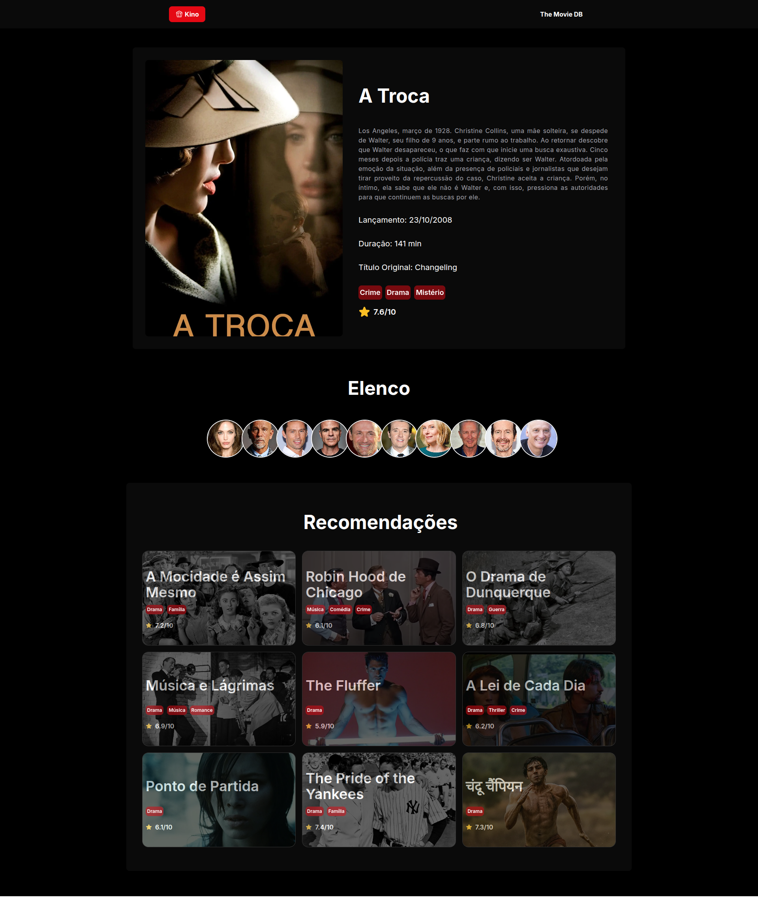

# 🎬 Kino
Kino é um projeto que exibe filmes, séries e etc. No qual você pode ver tudo sobre seus filmes e séries desejadas, além disso é possível saber mais sobre o elenco dos filmes e séries.

## 📸 Screenshots

### Tela Inicial


### Detalhes do Filme


### Detalhes Ator


### Slider com Filmes


## ⚙️ Configuração e Ambiente

1. Renomei o arquivo .env.sample para .env e dentro dele preencha as variáveis de ambiente com as suas informações da API do [The MovieDB](https://www.themoviedb.org/)

3. No terminal, clone o repositório do projeto digitando o seguinte comando:

```bash
  git clone https://github.com/alissonromaosantos/kino.git
```

4. Navegue até a página do projeto com o seguintes comando:

```bash
cd kino
```

5. Abra o projeto no [VSCode](https://code.visualstudio.com/download): 
```bash
code .
```

6. No terminal, digite o seguinte comando para instalar as dependências do projeto:

```bash
npm install
```

7. Já com o projeto na sua máquina e as dependências instaladas, você pode rodar o projeto no ambiente de desenvolvimento ou em produção digitando o seguinte comando no terminal:

```bash
npm run dev
```
ou 
```bash
npm start
```

Pronto, processo de configuração de ambiente finalizado.

**OBS:** *Faça o fork do projeto caso prefira ou não consiga realizar o clone do projeto.*

## 🛠️ Tecnologias
- [Next.js](https://nextjs.org/)  
- [React.js](https://react.dev/)  
- [TypeScript](https://www.typescriptlang.org/)  
- [Tailwind CSS](https://tailwindcss.com/) 

## 🚀 Deploy
```txt
https://kino-q1wy-cq5qsqdoo-alissons-projects-6c94b02a.vercel.app/filmes
```

---

<p align="center">&copy; Desenvolvido por <a href="https://www.linkedin.com/in/alissonromaosantos">Alisson Romão Santos</a></p>